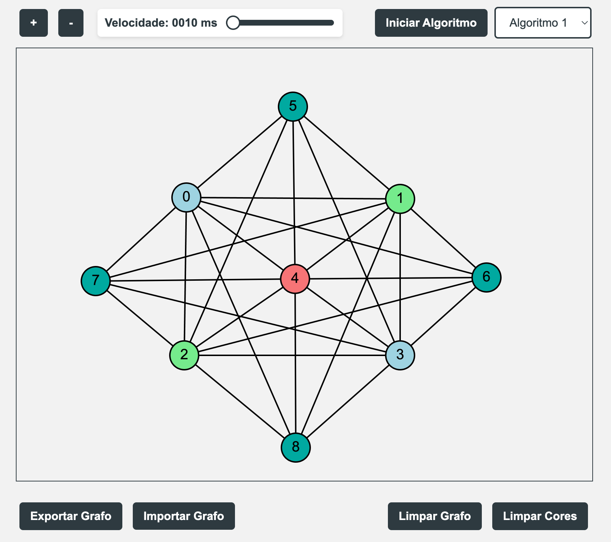

# Número Cromático para Grafos 🎨

Este projeto é uma aplicação web interativa que permite visualizar e manipular grafos, explorando o conceito de número cromático e suas aplicações práticas. Com ele, os usuários podem adicionar nós, conectar nós, mover nós e executar algoritmos de coloração.

## Descrição do Projeto

A **Teoria dos Grafos** é um ramo da matemática que estuda as propriedades de grafos, que são estruturas formadas por **vértices** (ou nós) e **arestas** (ou conexões). Este projeto explora o **número cromático** de um grafo, que é o menor número de cores necessárias para colorir os vértices de forma que dois vértices adjacentes não compartilhem a mesma cor. 🌈

## Funcionalidades

- ➕ **Adicionar Nós**: Clique em qualquer parte do canvas para adicionar um nó.
- 🔗 **Conectar Nós**: Clique com o botão direito em um nó para selecioná-lo e clique em outro nó para criar uma aresta.
- ✋ **Mover Nós**: Arraste um nó com o botão esquerdo do mouse para movê-lo.
- 🖱️ **Mover Canvas**: Use o checkbox para mover o canvas ao arrastar.
- 🔍 **Zoom**: Aumente ou diminua o zoom do canvas usando os botões de zoom.
- ⚙️ **Algoritmos**: Selecione e inicie diferentes algoritmos de coloração.
- 📤 **Exportar/Importar Grafos**: Exporte o grafo atual para um arquivo ou importe um grafo de um arquivo de texto.
- 🧹 **Limpar Grafo/Cores**: Limpe o grafo ou as cores aplicadas.

## Importância do Número Cromático

O número cromático é importante para várias aplicações práticas, como:

- 📅 **Planejamento de Horários**: Evita conflitos de horários em aulas e eventos.
- 🌐 **Design de Redes**: Ajuda a alocar canais de comunicação de forma eficiente.
- 🎲 **Jogos de Tabuleiro**: Garante que peças que não podem estar próximas não se sobreponham.

## Complexidade NP-Completo

O problema de determinar o número cromático de um grafo é classificado como **NP-completo**. Embora seja possível verificar se uma coloração é válida em tempo polinomial, não se conhece um algoritmo eficiente que resolva o problema em todos os casos. 🚫

## Instalação

Para executar este projeto localmente, clone o repositório e abra o arquivo `index.html` em um navegador web. 📂

## Live Demo

🔗 [Experimente a Demo ao Vivo!](https://chicogborba.github.io/chromaticNumberGraph/)

## Contribuidores

Este projeto foi desenvolvido por:

- 👤 Francisco Borba
- 👤 Matheus Magri

## Licença

Este projeto está licenciado sob a **Licença MIT**. 📜
